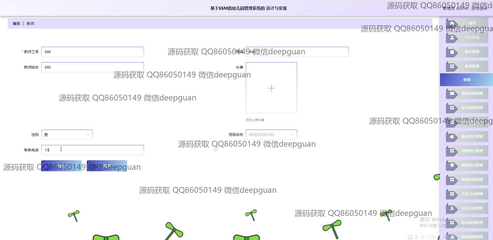
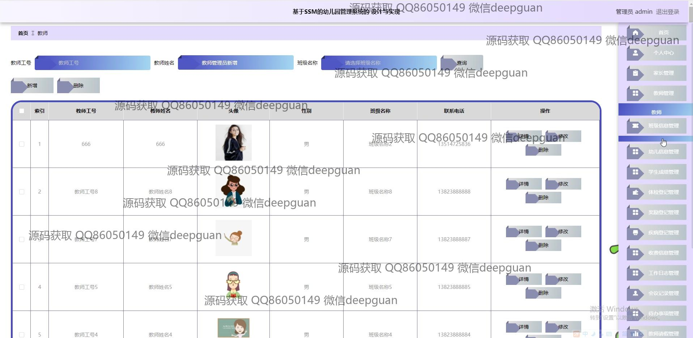

<h1 align="center">基于SSM的幼儿园管理系统的 设计与实现</h1>

## 简介
幼儿园管理系统：角色分为管理员、教师和家长；提供新闻公告编辑、教师信息管理、家长留言管理、体检记录、疫情上报、图书信息录入、请假审批和资源信息管理等功能。    --计算机毕业设计源码；毕设源码；java毕业设计源码

## 联系方式

<h3 align="center">获取完整代码与数据库文件 + 微信：deepguan QQ: 86050149 QQ群: 783742310</h3>

<h3 align="center">可帮忙远程部署 包运行成功！提供远程部署、修改代码、设计文档指导、代码讲解等服务！</h3>

## 功能介绍（完整见运行截图）
管理员：主要负责幼儿园管理系统的各项事务，包括登录、注册及退出功能。管理员可以通过系统浏览和编辑新闻公告，通过导航栏访问休假、勤务、成长记录、收支管理、工作日志等模块。此外，系统提供疫情上报、病历记录、图书管理和教师请假审批等功能。管理员可进行用户注册审批，查看和回复家长留言，并管理教师、班级及幼儿的信息。管理功能全面，界面设计直观简洁。

教师：教师在系统中可以查看课程安排，进行信息管理、考勤记录和教师请假。教师界面提供新闻公告编辑、体检信息记录和疫情上报功能。教师可以输入和管理个人信息与班级、幼儿的相关资料，记录成长档案和成绩管理。系统为教师的课程与幼儿成长记录提供了便捷的管理工具，使日常管理工作更加高效。

家长：家长主要通过系统查看和管理孩子的信息。可访问用户界面查看孩子的体检信息、成绩及班级资讯，留言模块可以与教师和管理员沟通交流，并能上传健康码及其他相关数据。家长还能参与到系统的新闻公告与信息管理中，获取幼儿园发布的最新动态，系统旨在家长和幼儿园之间建立更好的沟通和信息共享渠道。

学生：学生信息是幼儿园管理系统的重要组成部分。系统提供学生信息管理、成长记录、成绩管理等功能模块，可以查看学生的健康体检、成绩等数据。系统界面设计易于信息录入与查看，教师和家长可以通过管理功能查询学生的详细信息，包括个人资料和学籍变更记录，确保学生信息的及时更新与准确管理。

## 运行截图

本代码来源于网络,仅供学习参考使用!

